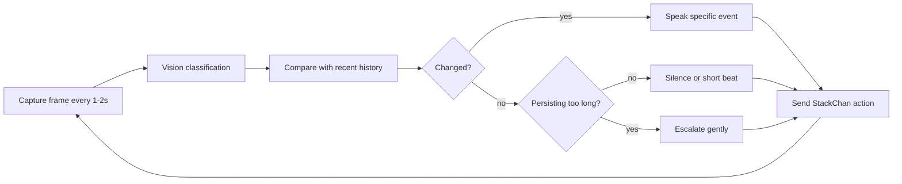

# StackChan Desk Commentator

## Pitch

DeskChan StackChan is a physical AI commentator for desk work. StackChan watches a real desk through its camera, classifies visible actions every 1-2 seconds, and reacts with short Kansai-dialect voice lines: encouragement, playful commentary, spill warnings, phone-use nudges, posture breaks, and demo-friendly callouts.

The point is not generic productivity tracking. The demo shows low-latency multimodal inference making a small embodied robot feel present: it notices tiny desk changes before the moment is gone.

## Hackathon Fit

- Track focus: Track 1, Multiverse Agents.
- Physical AI: StackChan is the embodied desk-side commentator.
- Multimodal: camera frame of a real desk plus recent history and structured JSON output.
- Agent shape: vision, state manager, and banter/action selection cooperate through one schema.
- Speed story: the same frame/history prompt runs on Gemini Flash-Lite for baseline testing and Cerebras `gemma-4-31b` for low-latency comparison.
- Demo story: fast comments matter because desk events are transient: a mug near the edge, a hand crossing near a cup, a phone pickup, or a short typing burst.

## Product Shape

The MVP watches a desk and returns one StackChan action packet:

1. Capture a frame from StackChan camera every 1-2 seconds.
2. A multimodal model classifies the visible desk state.
3. A state manager compares the new state with recent history.
4. If the same state continues, the app suppresses repeats, uses a silent beat, or rotates to light banter.
5. If a state persists too long, the app escalates gently: phone pickup becomes phone-too-long, still posture becomes stretch suggestion.
6. StackChan receives expression, motion, intensity, and `audio_key`.
7. Audio is played from pre-generated Gemini TTS WAV files, so timing is stable.

## Action Classes

The browser app also has a scripted demo mode for recording. It fires these states in order with pre-generated audio:

| Order | State | Trigger | Voice variations | Tone |
| --- | --- | --- | --- | --- |
| 1 | `greeting` | 顔を検知（着席） | 「お、来たな。今日も実況していくで！」 / 「おはようさん。今日もよろしゅう」 / 「待っとったで。さあ始めよか」 | 明るい・軽め |
| 2 | `work_start` | PC前で手が動き始める | 「コード書き始めたな、がんばれ」 / 「お、仕事モード入ったか」 / 「よっしゃ、いくで」 | のんびり |
| 3 | `typing_fast` | タイピング高速・継続 | 「ノってきたやん、ええ感じ」 / 「お、手が止まらんな。調子ええで」 / 「その勢いや！」 | 平常〜やや上げ |
| 4 | `cup_danger` | マグカップが机の端／PC付近 | 「あー！カップ危ない！こぼれるって！」 / 「ストップストップ！それこぼすやつ！」 / 「奥や奥！カップ奥に置き！」 | 焦り・テンション高 |
| 5 | `phone_pickup` | スマホを手に取る | 「お、スマホ触ったな」 / 「ん？スマホ登場か」 / 「お休憩入ります？」 | 軽い・様子見 |
| 6 | `phone_overuse` | スマホ継続（一定時間超） | 「触りすぎちゃう？Xばっか見とらんと、仕事仕事！」 / 「もう何分見とんねん。そろそろ戻ってこい」 / 「タイムラインは逃げへんから。手ぇ動かそ」 | お節介・強め |
| 7 | `yawn` | あくびを検知 | 「眠いんかい！しっかりせえ！」 / 「ふぁ〜って、こっちまで眠なるわ」 / 「コーヒーでもいったら？」 | ツッコミ |
| 8 | `focus_achieved` | 長時間集中を達成 | 「1時間集中、えらいえらい！」 / 「よう頑張った。実況席も感動やで」 / 「ナイスファイト。ひと休みしよ」 | 称賛・締め |

### Normal Work Commentary

| Visible action | Audio key | Example line |
| --- | --- | --- |
| Work starts | `desk_work_start` | お、仕事始めたな。今日もコード書くんか、がんばれよ。 |
| Long same posture | `desk_posture_long_still` | もう40分動いてへんで。ちょっと伸びしようや。 |
| Fast typing | `desk_typing_fast` | お、ノってきたやん。今めっちゃ速いで。 |
| Typing stops | `desk_typing_stopped` | 止まったな。詰まっとる顔やそれ。 |
| Drinking | `desk_hydration` | 給水ナイス。水分大事やからな。 |

### Device And Risk Detection

| Visible action | Audio key | Example line |
| --- | --- | --- |
| Mug near edge | `desk_mug_near_edge` | あ、マグカップ危ないって。こぼれるこぼれる。 |
| Mug near PC | `desk_mug_near_pc` | カップ、もうちょい奥に置こ。PCに近すぎて事故るで。 |
| Hand crosses cup/keyboard path | `desk_hand_between_cup_keyboard` | 手の通り道にカップあるで。そこ、危険地帯や。 |
| Clutter grows | `desk_clutter_warning` | 机ぐちゃぐちゃやん。一回片付けたら？ |
| Phone pickup | `desk_phone_pickup` | お、スマホ触ったな。5分で戻ってこいよ。 |
| Phone continues too long | `desk_phone_too_long` | スマホ長ない？そろそろ作業に帰ってきてもろて。 |
| Leaves seat | `desk_leave_seat` | 離席確認。サボりちゃうやろな？ |

### Entertainment And Demo Beats

| Visible action | Audio key | Example line |
| --- | --- | --- |
| Yawn | `desk_yawn` | 眠いんか。しっかりせえ。 |
| One hour focus | `desk_focus_one_hour` | 1時間集中やん、えらいえらい。実況席も熱くなってきました。 |
| Repeated motion | `desk_repeated_motion` | さっきから同じことしてへん？バグっとるんちゃう。 |
| Dark lighting | `desk_lighting_dark` | 暗いて。目悪なるで、電気つけ。 |

## State Machine



## Structured Output

```json
{
  "reply": "あ、マグカップ危ないって。こぼれるこぼれる。",
  "safety_level": "warn",
  "game_phase": "desk_risk",
  "stackchan": {
    "expression": "surprised",
    "motion": "shake",
    "audio_key": "desk_mug_near_edge",
    "intensity": 3
  },
  "actions": ["Move the mug away from the desk edge."],
  "timers": [],
  "visual_checklist": ["マグカップ", "机の端", "PCとの距離", "手の通り道"],
  "agent_notes": [
    {"agent": "vision", "vote": "mug near edge"},
    {"agent": "strategy", "vote": "warn but do not repeat every frame"},
    {"agent": "banter", "vote": "desk_mug_near_edge"}
  ],
  "demo_caption": "StackChanが机上の小さな危険に低遅延でツッコミます。"
}
```

## Implementation Plan

- Use `data/desk_voice_lines.json` as the fixed voice key set.
- Generate TTS before the demo:

```bash
python -m kitchen_chan.tts --input data/desk_voice_lines.json --out public/audio --model gemini-3.1-flash-tts-preview --voice Puck --speed 1.5
```

- Run the bridge:

```bash
kitchen-chan bridge --host 0.0.0.0 --port 8787
```

- Open `http://localhost:8787/`, choose `Desk work`, and start auto demo.

## 60 Second Demo Script

| Time | Human action | StackChan reaction | Point |
| --- | --- | --- | --- |
| 0-6s | Show StackChan watching the desk. | `desk_demo_intro` | Physical embodied commentator. |
| 6-14s | Start typing. | `desk_work_start`, `desk_typing_fast` | It reads hand/keyboard activity. |
| 14-24s | Move mug near keyboard edge. | `desk_mug_near_edge` | Low latency matters before a spill. |
| 24-34s | Pick up smartphone. | `desk_phone_pickup` then `desk_phone_too_long` | History turns a one-time action into a duration-aware nudge. |
| 34-44s | Stop typing and stare at screen. | `desk_typing_stopped` | Playful commentary for a stuck moment. |
| 44-52s | Dim the lights or show clutter. | `desk_lighting_dark` or `desk_clutter_warning` | Demo-friendly scene change. |
| 52-60s | Side-by-side latency overlay. | `desk_demo_compare`, `desk_demo_final_line` | Cerebras/Gemma 4 makes the desk commentary arrive in time. |

## Safety And Tone

- Comment on visible desk state, not personal identity or body.
- Keep warnings practical and short.
- Avoid always-on surveillance framing. The product is a hackathon demo for embodied multimodal reactions.
- If the frame is ambiguous, say the camera needs adjustment instead of hallucinating.
